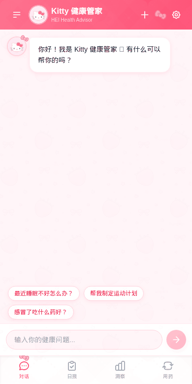

# HEI-agent — AI 健康管家

> **v3.0 Naive Agent Mode** — 单 Agent + ReAct + 13 Tools  
> 简洁、可控、可测试的 AI 健康助手后端

[]()
[]()
[]()
[]()

---

## Demo 演示

<p align="center">
  
</p>

<p align="center">
  <sub>移动端完整 Demo：对话问答 → RAG 引用与耗时 → 日报填写 → 健康洞察 → 用药管理</sub>
</p>

---

## 架构概览

```
┌─────────────────────────────────────────────────────────────┐
│                   HEI-agent (FastAPI, Port 8000)              │
├─────────────────────────────────────────────────────────────┤
│                                                              │
│  ┌──────────────────────────────────────────────────────┐   │
│  │        System Prompt (每轮动态注入)                    │   │
│  │  ┌────────────┐  ┌────────────┐                      │   │
│  │  │ MEMORY.md  │  │  USER.md   │  ← 纯文本文件        │   │
│  │  │ Agent 笔记 │  │ 用户档案   │     ProfileService    │   │
│  │  └────────────┘  └────────────┘                      │   │
│  └──────────────────────────────────────────────────────┘   │
│                         │                                    │
│  ┌──────────────────────▼───────────────────────────────┐   │
│  │              ChatAgent (ReAct Loop)                   │   │
│  │                                                       │   │
│  │  while not done:                                      │   │
│  │    response = llm.chat(messages, tools)               │   │
│  │    if tool_calls:                                     │   │
│  │      读 Tool → 并行执行                                │   │
│  │      写 Tool → 串行 + 用户确认                         │   │
│  │    else: return response                              │   │
│  └──────────────┬────────────────────────────────────────┘   │
│                 │                                            │
│  ┌──────────────┼──────────────┐                            │
│  ▼              ▼              ▼                            │
│ Read Tools    Write Tools    Tool Registry                  │
│ (8 个)        (5 个)         ─ 并行/串行调度               │
│                              ─ 确认机制                    │
│  ┌──────────────┴──────────────────────┐                    │
│  │           Service Layer             │  ← 单点入口        │
│  │  medication / health_log /          │                    │
│  │  knowledge  / memory / profile     │                    │
│  └──────┬──────────────┬──────────────┘                    │
│         │              │                                    │
│  ┌──────▼──────┐ ┌─────▼──────┐                            │
│  │   Qdrant    │ │   SQLite   │                            │
│  │ RAG 检索    │ │ 业务+记忆  │                            │
│  └─────────────┘ └────────────┘                            │
└─────────────────────────────────────────────────────────────┘
```

**核心理念**：一个聊天 Agent，LLM 自行判断意图 → 调用对应 Tool → 返回结果。  
Agent Tool 和 API endpoint 走同一个 Service 层，数据一致。

---

## 分层记忆系统（受 Hermes Agent 启发）

```
Layer 1: MEMORY.md          → 每轮注入 system prompt
  Agent 的动态笔记，LLM 通过 remember 工具写入
  例："用户对花粉过敏"、"偏好低盐饮食"

Layer 2: USER.md            → 每轮注入 system prompt
  静态用户档案，开发者手动维护
  例："name: 小明\nage: 28\nfocus: 健康管理"

Layer 3: SQLite memories    → LLM 主动 search_memory
  关键词检索（LIKE 匹配），LLM 自定关键词
  例：search_memory(keywords="花粉 过敏")

Layer 4: SQLite sessions    → LLM 主动 search_sessions
  对话摘要，跨 session 回忆
  例：search_sessions(keywords="糖尿病 讨论")
```

**设计原则**：模型自己决定何时搜索、搜索什么关键词。不自动检索、不做向量语义匹配。零 API 调用成本。

---

## Tool 清单（13 个）

### 读 Tool（并行执行，无副作用）

| Tool | 说明 | 数据源 |
|------|------|--------|
| `search_health` | 检索健康知识 | Qdrant `health_knowledge`（Dense + Sparse Hybrid Search + RRF + Rerank） |
| `search_medication` | 检索药品信息 | Qdrant `medication_info` |
| `search_tcm` | 检索中医知识 | Qdrant `tcm_wellness` |
| `search_memory` | 关键词搜索长期记忆 | SQLite LIKE 匹配 |
| `search_sessions` | 关键词搜索历史会话 | SQLite LIKE 匹配 |
| `describe_image` | 图片识别 | DashScope Vision（TODO） |
| `get_my_medications` | 查询在服药品 | SQLite |
| `get_health_logs` | 查询健康打卡 | SQLite |

### 写 Tool（串行执行 + 用户确认）

| Tool | 说明 |
|------|------|
| `add_medication` | 添加药品（需确认） |
| `update_medication` | 修改药品（需确认） |
| `remove_medication` | 删除药品（需确认） |
| `log_health` | 记录健康数据（需确认） |
| `remember` | 写入长期记忆 → SQLite + MEMORY.md（需确认） |

---

## 确认机制

写操作需要用户确认后执行：

```
用户: "帮我删除阿莫西林"

Agent:
  ① get_my_medications() → 查出阿莫西林 id=3
  ② 回复: "确认删除 [阿莫西林 每天3次]？"

用户: "确认"

Agent:
  ③ remove_medication(id=3) → 执行
  ④ 回复: "已删除 ✅"
```

写意图预路由：chat_agent.py 内置正则匹配，识别明确的添加/修改/删除/记录意图，直接跳转到确认流程，避免 LLM 的「先读后写」倾向。

---

## 项目结构

```
HEI-agent/
├── app/
│   ├── main.py                    # FastAPI 入口
│   ├── config.py                  # 配置（demo_mode 等）
│   ├── database.py                # SQLite 异步引擎
│   │
│   ├── agent/                     # ⭐ Agent 层（v3 核心）
│   │   ├── chat_agent.py          # ReAct while 循环 + 写意图预路由
│   │   ├── tool_registry.py       # 13 Tools 注册 + 并行/串行调度
│   │   └── tools/                 # 13 个 Tool 实现
│   │       ├── knowledge.py       # search_health/med/tcm
│   │       ├── medication.py      # 用药 CRUD
│   │       ├── health_log.py      # 健康日志
│   │       ├── memory_tool.py     # search_memory/search_sessions/remember
│   │       └── vision.py          # describe_image
│   │
│   ├── services/                  # ⭐ 统一数据层
│   │   ├── medication_service.py  # SQLite CRUD
│   │   ├── health_log_service.py  # 健康日志读写
│   │   ├── knowledge_service.py   # RAG 封装（Qdrant Hybrid Search）
│   │   ├── memory_service.py      # SQLite 关键词检索
│   │   └── profile_service.py     # MEMORY.md / USER.md 管理
│   │
│   ├── rag/                       # RAG 引擎（Qdrant Hybrid Search）
│   ├── llm/                       # LiteLLM 路由器
│   ├── api/v1/                    # REST API
│   │   ├── chat.py                # 对话接口 → ChatAgent
│   │   ├── health.py              # 健康接口 → Service
│   │   ├── medication.py          # 用药接口 → Service
│   │   └── sessions.py            # 会话管理
│   └── schemas/                   # Pydantic 模型
│
├── demo-frontend/                 # Vue.js 演示前端
├── tests/                         # 测试套件
│   ├── run_benchmark.sh           # 一键测试脚本
│   ├── benchmark_runner.py        # 测试引擎
│   ├── test_data/                 # 125+ 测试用例
│   └── benchmarks/                # 历史报告
├── data/knowledge/                # 知识库源文件
├── data/profiles/                 # MEMORY.md / USER.md 存储
└── docs/                          # 设计文档
```

---

## 技术栈

| 组件 | 选型 | 说明 |
|------|------|------|
| LLM | DeepSeek（LiteLLM 路由） | 支持多 Provider failover |
| Agent 框架 | 原生 Python ReAct 循环 | 无框架依赖，最大可控性 |
| 向量数据库 | Qdrant（Docker） | 仅用于 RAG 知识库检索 |
| 业务数据库 | SQLite | 用药记录、健康日志 |
| 记忆系统 | SQLite + MEMORY.md/USER.md | 分层记忆，LLM 自主关键词检索 |
| Embedding | DashScope API | RAG 向量化 |
| API 框架 | FastAPI | 异步、OpenAPI 文档自动生成 |
| 前端 | Vue.js 3 + Vite | 演示用 |

---

## 快速开始（Demo 模式）

Demo 模式仅需 Qdrant + LLM API key，无需 PostgreSQL/Redis/JWT。

```bash
# 1. 配置
cp .env.example .env
# 编辑 .env：DEMO_MODE=true, DEEPSEEK_API_KEY, DASHSCOPE_API_KEY, QDRANT_URL

# 2. 启动 Qdrant
docker run -d -p 6333:6333 qdrant/qdrant

# 3. 导入/重建知识库（首次导入或 Hybrid Search schema 变更时使用 --recreate）
python scripts/ingest_knowledge.py --recreate

# 4. 启动后端
python -m uvicorn app.main:app --host 0.0.0.0 --port 8000

# 5. 启动前端
cd demo-frontend && npm install && npm run dev -- --host 0.0.0.0 --port 5173
```

| 地址 | 说明 |
|------|------|
| `http://localhost:5173` | 前端页面 |
| `http://localhost:8000/health` | 健康检查 |
| `http://localhost:8000/docs` | Swagger API 文档 |

---

## Benchmark 指标

| 指标 | 结果 | 测试规模 | 说明 |
|------|------|----------|------|
| RAG Recall@3 | 78.9% | 57 条 | 3 个知识库，Qdrant Dense + Sparse Hybrid Search |
| Tool 调用准确率 | 77.8% | 36 条 | LLM 自主选择 13 个 Tool |
| 端到端延迟 P95 | 5.3s | 10 次 | 含 LLM 推理 + RAG 检索 |
| 记忆检索 Recall@5 | 100% | 20 记忆 + 10 查询 | SQLite 关键词 LIKE 匹配 |
| 确认机制正确率 | 100% | 15 个写操作 | 预路由 + 确认流程 |
| **总体评分** | **82.8/100 🟢** | | |

```bash
# 一键运行全部测试
bash tests/run_benchmark.sh all
```

---

## 设计决策

### 为什么 RAG 用向量检索，记忆用关键词检索？

| | RAG 知识库 | 记忆系统 |
|------|------|------|
| **数据量** | 774 条 chunks | 每用户 ~50 条 |
| **查询方式** | 自然语言问题 | LLM 生成的关键词 |
| **检索方法** | Qdrant Hybrid Search（dense vector + sparse lexical + RRF） | SQLite LIKE |
| **成本** | Embedding API（仅导入时） | 0 API 调用 |

知识库既需要语义理解（"感冒怎么办"→找到"上呼吸道感染"），也需要保留疾病名、药品名、检查指标等精确词项匹配能力，所以 RAG 使用 Qdrant 原生 Hybrid Search：dense vector 负责语义召回，sparse lexical vector 负责关键词召回，再用 RRF 融合候选并交给 rerank。  
个人记忆语料小、关键词特征明显（"青霉素""过敏"），LIKE 匹配即足够。

### 为什么让 LLM 决定搜索什么？

传统 RAG 是「先检索再回答」——每次对话自动检索。  
这个项目让 LLM 自己判断是否需要搜索、搜索什么关键词，减少无关检索，提高效率。

---

## 重构历程

| 版本 | 分支 | 架构 |
|------|------|------|
| v1 | `main` | LangGraph Multi-Agent + Pipeline + ContextAssembler |
| v3 | `naive-agent-mode` | **单 Agent + ReAct + 13 Tools + 分层记忆** |

---

## License

MIT
